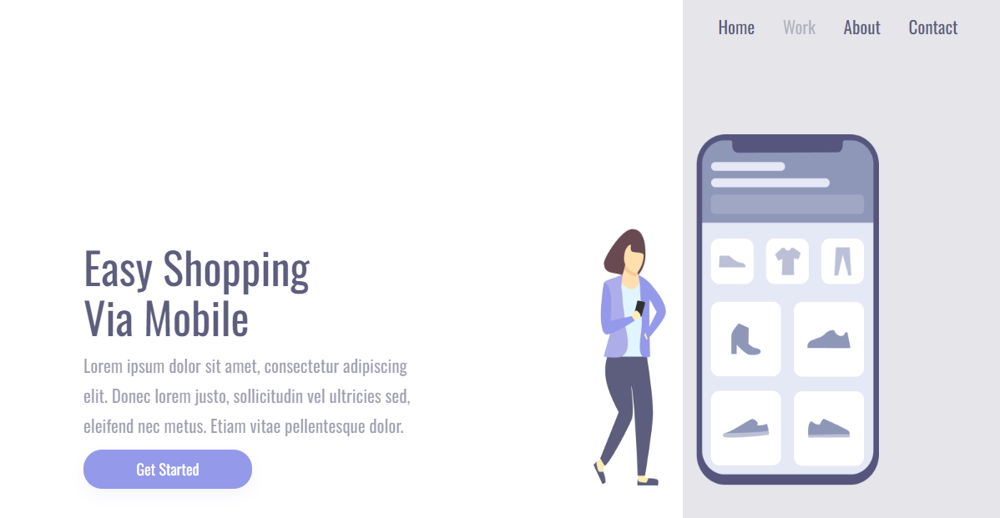
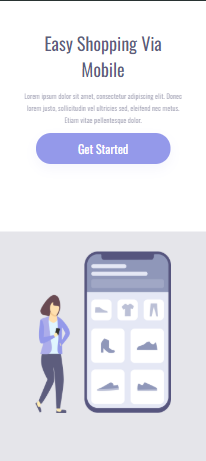

# Easy Shopping: Projeto CSS 02 e Responsividade

Página de apresentação de um app de compras pelo celular ("Easy Shopping Via Mobile"), desenvolvida como projeto de estudo de CSS e responsividade do DevClub.




## O que o projeto pratica

- Layout em duas colunas: textos com botão **Get Started** de um lado e ilustração com menu do outro
- Menu de navegação (Home, Work, About, Contact)
- Fonte Oswald via Google Fonts
- Responsividade com `@media` (abaixo de 1280px o bloco de texto passa a ocupar a largura total)

## Tecnologias

- HTML5
- CSS3

## Como rodar

```bash
git clone https://github.com/fabriciabarbisan/projeto-css-02-e-responsividade-devclub.git
```

Abra o `index.html` no navegador e redimensione a janela para ver a adaptação do layout.

## Estrutura

```
├── index.html
├── style.css
└── img/
```

<!-- Se publicar o projeto (GitHub Pages, Netlify, Vercel), adicione o link aqui: ## Demo -->
